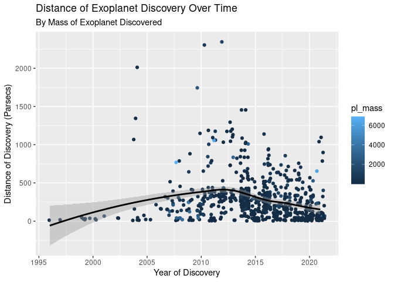

Project proposal
================
Annie, Matt, and Ethan

``` r
library(tidyverse)
library(broom)
```

## 1. Introduction

General research question: What are the main driving factors in
exoplanet discovery, and how can these factors influence the future of
exoplanet exploration? Do trends suggest that we diverge and discover an
infinite number of exoplanets or do they converge to a finite number? If
they converge, what is that number?

Sub questions:

1.  How has the number of discovered exoplanets changed over time (in
    relation to the type of discovery method, discovery facility,
    distance from earth, and….)?

2.  How does the number of discoveries vary across countries and how
    does the result relate to the country’s gdp?

3.  Has the average distance of exoplanet discovery increased over time,
    and if so, can we expect to see the pace of discovery decrease in
    the future due to the constraints of our current technology?

4.  How does earth’s temperature/surface gravity/eccentricity differ
    from that of the exoplanets, and what conclusion can we draw from
    the result about the degree of habitability of exoplanets?

5.  Is the rate at which we invent new technology for finding exoplanets
    increasing or decreasing?

6.  How much are exoplanet discoveries affected by new technology?

7 . How many discoveries can we expect in the near future? 5-20 years?
given the current pace of discovery, and the possibility of innovative
technological advancements?

The data set that we have chosen to use is NASA Exoplanet Archives
Planet Systems dataset. Our data comes from The Planetary Systems
Composite Parameters Planet Data table that is publicly available on the
NASA Exoplanet Archive website. The data sets consist of a compilation
of system, stellar, and planetary parameters for known confirmed
exoplanets, and we have chosen 23 variables that we believe will be
relevant to answering our research question (e.g. discovery year,
discovery facility, planet radius, and distance from earth). We decided
to use this data to create two data frames for our project where one
includes unfiltered data with missing values under many variables except
the discovery year, and the other one includes filtered data for all 23
variables. These data include stellar parameters (such as positions and
magnitude), exoplanet parameters (such as masses and orbital
parameters), and discovery/characterization data (such as radial
velocity curves and photometric light curves).

The data that we are using is a compilation of data from many different
exoplanet transit survey programs from all around the world (and over
the world!). Some of the programs utilize facilities that are based on
the ground, while others utilize facilities/machinery that are located
in space. Some of the most notable programs include the Kepler space
mission (Kepler public service data), the K2 space mission (K2 public
service data), and the CoRoT space mission (CoRot exoplanet survey
data).

## 2. Data

``` r
alldata <- read_csv("/cloud/project/data/filtereddata.csv")
alldataunfiltered <- read_csv("/cloud/project/data/unfiltereddata.csv")

glimpse(alldata)
```

    ## Rows: 695
    ## Columns: 23
    ## $ pl_name            <chr> "51 Eri b", "55 Cnc b", "55 Cnc e", "BD+20 594 b", …
    ## $ hostname           <chr> "51 Eri", "55 Cnc", "55 Cnc", "BD+20 594", "CoRoT-1…
    ## $ starsnum           <dbl> 3, 2, 2, 1, 1, 1, 1, 1, 1, 1, 1, 1, 1, 1, 1, 1, 1, …
    ## $ planetsnum         <dbl> 1, 5, 5, 1, 1, 1, 1, 1, 1, 1, 1, 1, 2, 1, 1, 2, 2, …
    ## $ discoverymethod    <chr> "Imaging", "Radial Velocity", "Radial Velocity", "T…
    ## $ disc_year          <dbl> 2015, 1996, 2004, 2016, 2008, 2010, 2010, 2010, 201…
    ## $ disc_facility      <chr> "Gemini Observatory", "Lick Observatory", "McDonald…
    ## $ orbital_period     <dbl> 1.168800e+04, 1.465160e+01, 7.365474e-01, 4.168550e…
    ## $ pl_orbsmax         <dbl> 12.000000, 0.113400, 0.015440, 0.241000, 0.027520, …
    ## $ pl_radius          <dbl> 13.400, 13.900, 1.875, 2.578, 16.700, 10.870, 16.03…
    ## $ pl_mass            <dbl> 635.66000, 263.97850, 7.99000, 22.24810, 327.35000,…
    ## $ pl_orbeccen        <dbl> 0.450, 0.000, 0.050, 0.000, 0.000, 0.530, 0.000, 0.…
    ## $ pl_eqtemp          <dbl> 700, 700, 1958, 546, 1898, 600, 1657, 1700, 1952, 1…
    ## $ st_spectype        <chr> "F0 IV", "K0 IV-V", "G8 V", "G", "G0 V", "K1 V", "F…
    ## $ st_eff_temp        <dbl> 7295, 5172, 5172, 5766, 5950, 5075, 6440, 5945, 603…
    ## $ st_radius          <dbl> 1.49, 0.94, 0.94, 1.08, 1.11, 0.79, 1.37, 1.01, 1.2…
    ## $ st_mass            <dbl> 1.65, 0.91, 0.91, 1.67, 0.95, 0.89, 1.27, 1.09, 1.1…
    ## $ st_met             <dbl> -0.027, 0.350, 0.350, -0.150, -0.300, 0.260, -0.030…
    ## $ st_surface_gravity <dbl> 4.31, 4.43, 4.43, 4.50, 4.25, 4.65, 4.22, 4.46, 4.3…
    ## $ sy_distance        <dbl> 29.7575, 12.5855, 12.5855, 179.4610, 787.9090, 338.…
    ## $ sy_vmag            <dbl> 5.21149, 5.95084, 5.95084, 10.84900, 13.62300, 15.2…
    ## $ sy_kmag            <dbl> 4.537, 4.015, 4.015, 9.368, 12.149, 11.782, 11.248,…
    ## $ sy_gaiamag         <dbl> 5.15806, 5.72973, 5.72973, 10.86440, 13.45700, 14.6…

``` r
glimpse(alldataunfiltered) #includes data for all exoplanets
```

    ## Rows: 4,528
    ## Columns: 23
    ## $ pl_name            <chr> "11 Com b", "11 UMi b", "14 And b", "14 Her b", "16…
    ## $ hostname           <chr> "11 Com", "11 UMi", "14 And", "14 Her", "16 Cyg B",…
    ## $ starsnum           <dbl> 2, 1, 1, 1, 3, 2, 1, 1, 1, 1, 2, 1, 1, 1, 1, 2, 1, …
    ## $ planetsnum         <dbl> 1, 1, 1, 2, 1, 1, 1, 1, 2, 2, 1, 1, 1, 1, 1, 1, 1, …
    ## $ discoverymethod    <chr> "Radial Velocity", "Radial Velocity", "Radial Veloc…
    ## $ disc_year          <dbl> 2007, 2009, 2008, 2002, 1996, 2008, 2008, 2018, 201…
    ## $ disc_facility      <chr> "Xinglong Station", "Thueringer Landessternwarte Ta…
    ## $ orbital_period     <dbl> 326.030000, 516.219970, 185.840000, 1773.400020, 79…
    ## $ pl_orbsmax         <dbl> 1.2900, 1.5300, 0.8300, 2.9300, 1.6600, 2.6000, 330…
    ## $ pl_radius          <dbl> 12.100, 12.300, 12.900, 12.900, 13.500, 12.500, 18.…
    ## $ pl_mass            <dbl> 6165.6000, 4684.8142, 1525.5000, 1481.0878, 565.737…
    ## $ pl_orbeccen        <dbl> 0.231, 0.080, 0.000, 0.370, 0.680, 0.080, NA, 0.042…
    ## $ pl_eqtemp          <dbl> NA, NA, NA, NA, NA, NA, 1700, NA, NA, NA, NA, 1600,…
    ## $ st_spectype        <chr> "G8 III", "K4 III", "K0 III", "K0 V", "G3 V", "G6 I…
    ## $ st_eff_temp        <dbl> 4742, 4213, 4813, 5338, 5750, 4979, 4060, 4893, 509…
    ## $ st_radius          <dbl> 19.00, 29.79, 11.00, 0.93, 1.13, 8.50, 1.31, 10.64,…
    ## $ st_mass            <dbl> 2.70, 2.78, 2.20, 0.90, 1.08, 2.30, 0.85, 0.99, 1.5…
    ## $ st_met             <dbl> -0.350, -0.020, -0.240, 0.410, 0.060, -0.052, NA, -…
    ## $ st_surface_gravity <dbl> 2.31, 1.93, 2.63, 4.45, 4.36, 2.82, 4.00, 2.42, 3.5…
    ## $ sy_distance        <dbl> 93.18460, 125.32100, 75.43920, 17.93230, 21.13970, …
    ## $ sy_vmag            <dbl> 4.72307, 5.01300, 5.23133, 6.61935, 6.21500, 5.5104…
    ## $ sy_kmag            <dbl> 2.282000, 1.939000, 2.331000, 4.714000, 4.651000, 3…
    ## $ sy_gaiamag         <dbl> 4.44038, 4.56216, 4.91781, 6.38300, 6.06428, 5.2747…

## 3. Data analysis plan

### Outcome and Predictor Variables

Y = number of exoplanets discovered each year, X = disc\_year, use group
by & summarise

Other explanatory variables may include average distance of discovery,
average mass of discovery, and method of discovery.

Y = number of exoplanets discovered by country, X = disc\_facility &
match with the corresponding country to create a new variable named
country, add another variable named gdp and find correlation

Y = rate of discovery by years, X = exoplanets discovered each
year/total number of exoplanets

### Preliminary Analysis & Summary Stats.

``` r
alldata %>%
  count(discoverymethod, sort = TRUE)
```

    ## # A tibble: 5 × 2
    ##   discoverymethod                   n
    ##   <chr>                         <int>
    ## 1 Transit                         607
    ## 2 Radial Velocity                  79
    ## 3 Imaging                           6
    ## 4 Transit Timing Variations         2
    ## 5 Orbital Brightness Modulation     1

The table above shows us the most common methods of exoplanet discovery.
This will be helpful later in our analysis when we consider the
constraints of modern technology on the discovery of new exoplanets.

``` r
alldata %>%
  ggplot(mapping = aes(
                        x = disc_year,
                        y = sy_distance,
                        color = pl_mass)) +
  geom_jitter() +
  geom_smooth(color = "black") +
  labs(
        x = "Year of Discovery",
        y = "Distance of Discovery (Parsecs)", 
        title = "Distance of Exoplanet Discovery Over Time",
        subtitle="By Mass of Exoplanet Discovered" ) 
```

    ## `geom_smooth()` using method = 'loess' and formula 'y ~ x'

<!-- -->

The plot above maps the discovery distance of exoplanets over time to
determine if there is a trend in the discovery distance of exoplanets.
Surprisingly, it seems that the average distance of discovery has been
decreasing over time since roughly 2012-2013. This will be important to
consider later in our analysis when we discuss whether the distance of
an exoplanet from the discovery facility makes it more difficult to
discover.

### Statistical Methods

One statistical method that we will be using, at least in the
preliminary stages of the project, will be using data taken over time to
determine a trend (rate of discovery), and then using various
calculations and predictive methods to estimate the same trend in the
future. This will likely take the form of a line plot (plotting
exoplanet discoveries over time) or a scatter plot in which we find a
line of best fit. We will then extend the line past the scope of our
data and aim to provide three estimates/predictions. We will provide an
upper bound (overestimate), a lower bound (low estimate), and a middle
estimate. We will rely on prior trends in the data, as well as any other
takeaways we get from our summary statistics to estimate the future
trend.

We are also considering a regression-based analysis to determine the
factors that have the largest impact on exoplanet discovery. Though we
have not learned how to use regression-based modelling features in
RStudio, we aim to try to incorporate it into our work.
